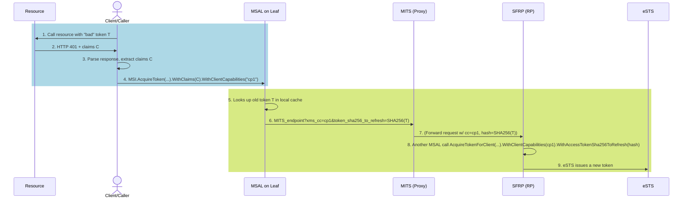
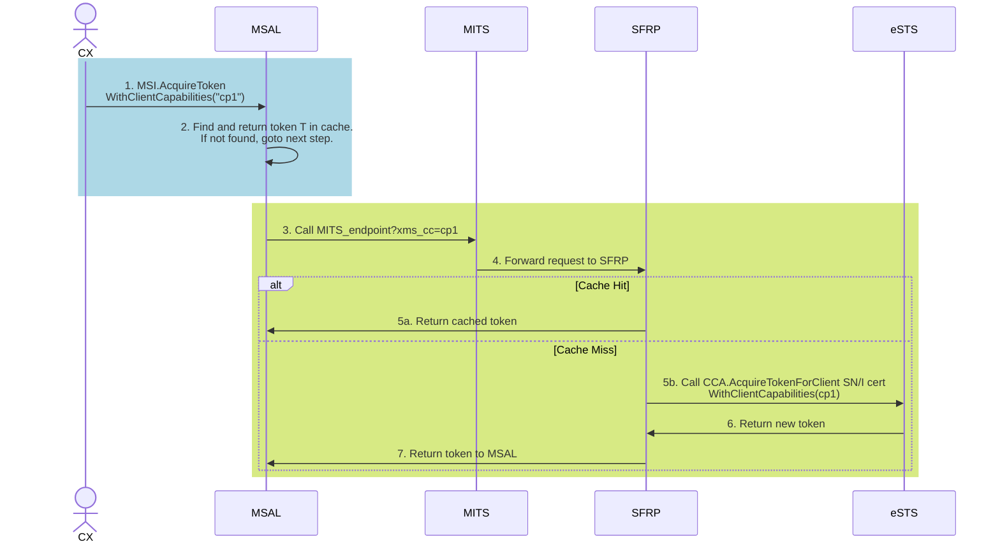

# MSAL Support for MSI v1 Token Revocation and Capabilities

## Feature Summary for AI Agents

This document describes the implementation of MSI v1 token revocation and client capabilities in the Microsoft Authentication Library (MSAL) for various languages. 

**Key Concepts:**
- **Client Capabilities**: Allows clients to indicate support for features like Continuous Access Evaluation (CAE)
- **Claims Challenge**: A mechanism used by Resource Providers to request token refresh
- **SHA256 Token Hashing**: Used to identify revoked tokens without transmitting the original token

**Implementation Scope:**
- This feature applies to Service Fabric and App Service managed identity environments only
- All MSAL language implementations (Python, JavaScript, Go, .NET, Java) must support these changes
- Changes primarily affect the ManagedIdentityClient classes in each MSAL library

**Naming Convention Mapping:**
| Generic Term | Python | JavaScript | .NET | Java | Go |
|-------------|--------|------------|------|------|-----|
| WithClientCapabilities() | client_capabilities=[] | clientCapabilities: [] | WithClientCapabilities() | clientCapabilities() | WithClientCapabilities() |
| WithClaims() | claims="..." | claims: "..." | WithClaims() | claims() | WithClaims() |

---

## Goals

1. Enable app developers and higher level SDKs (like Azure SDK) to use the [CAE protocol](https://learn.microsoft.com/en-us/entra/identity-platform/app-resilience-continuous-access-evaluation?tabs=dotnet) for token revocation scenarios (`WithClaims`, `WithClientCapabilities`).

## Implementation Compatibility Analysis

### Alignment with Existing MSAL Libraries

| MSAL Library | Compatibility Notes | Required Adjustments |
|--------------|---------------------|----------------------|
| MSAL .NET | Compatible with existing patterns. Already supports WithClaims and WithClientCapabilities in other contexts. | Minor adjustment to extend to ManagedIdentityClient |
| MSAL Python | Uses snake_case naming (acquire_token). Has similar patterns for client capabilities in MSAL proper. | Adapt naming to match existing style (client_capabilities, with_claims) |
| MSAL JavaScript | Uses camelCase and promise-based async patterns. Already supports claims and clientCapabilities. | Ensure alignment with existing options object pattern |
| MSAL Java | Uses builder pattern for configuration. Already supports claims and clientCapabilities concepts. | Extend existing builder pattern to ManagedIdentity |
| MSAL Go | Uses functional options pattern for configuration. | Implementation should match existing patterns |

## Implementation Requirements
These changes are only for Service Fabric and App service

### 1. Client API Changes

All MSAL implementations (Python, JavaScript, Go, .NET, and Java) must provide:

```
// Required Client API changes
client = ManagedIdentityClient(
    // Existing constructor parameters
    WithClientCapabilities(string[])  // Add this parameter
)

// Required AcquireToken API changes
result = client.AcquireToken(
    // Existing parameters
    WithClaims(string)                // Add this parameter
)
```

#### Language-Specific Implementation Examples

##### Go
```go
// Client constructor - follows existing functional options pattern
client, err := managedidentity.New(
    managedidentity.SystemAssigned(),
    managedidentity.WithClientCapabilities([]string{"cp1", "cp2"})
)

// AcquireToken with claims - follows existing pattern of passing options
result, err := client.AcquireToken(
    context.Background(),
    resource,
    managedidentity.WithClaims("claims1")
)
```

##### Python
```python
# Client constructor - follows snake_case naming convention
client = ManagedIdentityClient(
    client_capabilities=["cp1", "cp2"]
)

# AcquireToken with claims - follows existing pattern of keyword arguments
result = client.acquire_token(
    resource,
    claims="claims1"
)
```

##### JavaScript/TypeScript
```typescript
// Client constructor - follows existing configuration object pattern
const client = new ManagedIdentityClient({
  clientCapabilities: ["cp1", "cp2"]
});

// AcquireToken with claims - follows existing pattern of options object
const result = await client.acquireToken({
  resource: "https://resource",
  claims: "claims1"
});
```

##### .NET
```csharp
// Client constructor - follows existing fluent API pattern
var client = new ManagedIdentityClient(
    options => options.WithClientCapabilities(new string[] { "cp1", "cp2" })
);

// AcquireToken with claims - follows existing pattern with options builder
var result = await client.AcquireTokenAsync(
    resource,
    options => options.WithClaims("claims1")
);
```

##### Java
```java
// Client constructor - follows existing builder pattern
ManagedIdentityClient client = new ManagedIdentityClientBuilder()
    .clientCapabilities(Arrays.asList("cp1", "cp2"))
    .build();

// AcquireToken with claims - follows existing fluent API pattern
ManagedIdentityResult result = client.acquireToken()
    .resource(resource)
    .claims("claims1")
    .execute();
```

### 2. Token Revocation Mechanism

MSAL must implement the SHA256 token hashing function:
```
// Convert token to SHA256 hash string
string convertTokenToSHA256HashString(string token) {
    hash := sha256.New()
    hash.Write([]byte(token))
    hashBytes := hash.Sum(nil)
    return hex.EncodeToString(hashBytes)
}
```

Example outputs:
- `"test_token"` → `"cc0af97287543b65da2c7e1476426021826cab166f1e063ed012b855ff819656"`
- `"abcdefghijklmnopqrstuvwxyzABCDEFGHIJKLMNOPQRSTUVWXYZ0123456789-_.~"` → `"01588d5a948b6c4facd47866877491b42866b5c10a4d342cf168e994101d352a"`

#### Language-Specific Token Hashing Examples

##### Go
```go
func convertTokenToSHA256HashString(token string) string {
    hash := sha256.New()
    hash.Write([]byte(token))
    hashBytes := hash.Sum(nil)
    return hex.EncodeToString(hashBytes)
}
```

##### Python
```python
import hashlib

def convert_token_to_sha256_hash_string(token):
    hash_obj = hashlib.sha256(token.encode())
    return hash_obj.hexdigest()
```

##### JavaScript/TypeScript
```typescript
import { createHash } from 'crypto';

function convertTokenToSHA256HashString(token: string): string {
    return createHash('sha256').update(token).digest('hex');
}
```

##### .NET
```csharp
using System.Security.Cryptography;
using System.Text;

public static string ConvertTokenToSHA256HashString(string token)
{
    using var sha256 = SHA256.Create();
    byte[] bytes = Encoding.UTF8.GetBytes(token);
    byte[] hash = sha256.ComputeHash(bytes);
    return BitConverter.ToString(hash).Replace("-", "").ToLowerInvariant();
}
```

##### Java
```java
import java.nio.charset.StandardCharsets;
import java.security.MessageDigest;
import javax.xml.bind.DatatypeConverter;

public static String convertTokenToSHA256HashString(String token) throws Exception {
    MessageDigest md = MessageDigest.getInstance("SHA-256");
    byte[] digest = md.digest(token.getBytes(StandardCharsets.UTF_8));
    return DatatypeConverter.printHexBinary(digest).toLowerCase();
}
```

## Flow diagram - revocation event



### Steps Explanation:
1. CX creates an **MSAL Client** with `.WithClientCapabilities(cp1)`, to let the token issuer know that it is capable of handling token revocations.
2. The client (CX) calls some **Resource** with token **T**.
3. The resource detects **T** is bad (revoked) and returns **401** + **claims C**.
4. CX parses the WWW-Authenticate header, extracts the claims **C** and uses MSAL **AcquireToken** with `.WithClaims(C)`.
5. MSAL inspects its cache first. If it finds a token, the token is considered to have been revoked. MSAL needs to tell the token issuer about it, so that the token issuer can also bypass its own cache.
6. MSAL calls **MITS** with `xms_cc=cp1&token_sha256_to_refresh=SHA256(T)`.
7. **MITS** uses the information to bypass its own caches and to get a new token from its upstream **SFRP**.
8. **SFRP** uses MSAL again to get a **new** token from eSTS.

> [!IMPORTANT]
> This design is only applicable to MIRP api-version=2025-03-30 (for App Service). api-version for service fabric will be soon made available.

## Flow diagram - non-revocation event

The client "enlightenment" status is still propagated via the client capability "cp1".



## Parameter Processing Requirements

### `xms_cc` as a List Value (URL Encoding)

The `xms_cc` parameter can hold **multiple** client capabilities, formatted as a comma-separated list:
```
xms_cc=cp1,cp2,cp3
```

Implementation requirements:

1. **Sending**: When MSAL calls MITS, it must URL-encode the `xms_cc` parameter value because commas (`,`) must be encoded in query strings.
2. **Parsing**: MITS and SFRP must URL-decode and split on commas:
   ```
   // Pseudocode:
   string raw = URLDecode(request.Query["xms_cc"])
   string[] capabilities = raw.Split(',')
   ```

> [!NOTE]
> RPs or MITS should not bypass cache if a bad token is not passed by MSAL.

### Query Parameter Construction Examples

#### URL-Encoding the `xms_cc` Parameter

##### Go
```go
import "net/url"

func buildQuery(capabilities []string) string {
    // Join capabilities with comma
    capabilitiesStr := strings.Join(capabilities, ",")

    // URL-encode the joined string
    encodedCapabilities := url.QueryEscape(capabilitiesStr)

    return "xms_cc=" + encodedCapabilities
}
```

##### Python
```python
import urllib.parse

def build_query(capabilities):
    # Join capabilities with comma
    capabilities_str = ",".join(capabilities)

    # URL-encode the joined string
    encoded_capabilities = urllib.parse.quote(capabilities_str)

    return "xms_cc=" + encoded_capabilities
```

#### URL-Encoding the `token_sha256_to_refresh` Parameter

## Edge Cases and Error Handling

### Empty or Invalid Inputs

1. **Empty Client Capabilities**:
   - If capabilities array is empty, omit the `xms_cc` parameter from the request
   - Do not pass `xms_cc=` (empty value)
   - This is only for appservice and serviceFabric

2. **Empty Claims**:
   - If claims string is empty, proceed with token acquisition without claims
   - Do not add empty claims parameter to request

3. **WhenClaimsAreProvided**:
   - Look for token in cache, if found, use it for revocation
   - If token is not found in cache, proceed with token acquisition
   - The token found in cache should be used in `token_sha256_to_refresh` parameter with the correct converstion

### Threading and Concurrency

Implementations must be thread-safe:
- Multiple concurrent calls to `AcquireToken` with the same client should not cause race conditions
- Token cache access must be properly synchronized

## Cross-Library Consistency Requirements

To ensure consistent behavior across all MSAL implementations:

1. **Error Messages**: Use consistent error messages across libraries for similar failure scenarios
   - Token revocation errors should have similar messages
   - Validation errors should communicate the same issues

2. **Parameter Validation**: All implementations should validate:
   - Client capabilities array elements (no empty strings)
   - Claims string format (should be valid JWT format)
   - Resource URL format

3. **Return Values**: All implementations should return consistent metadata:
   - Token source (cache vs provider) should be indicated
   - Token expiration information should be standardized
   - Error information should follow consistent patterns

## Troubleshooting Guide

### Common Issues

1. **Incorrect Hash Generation**:
   - Verify character encoding is UTF-8 when converting string to bytes
   - Ensure hash output is lowercase hexadecimal format

2. **Query Parameter Issues**:
   - Verify all query parameters are properly URL-encoded
   - Check that commas in capability lists are encoded as %2C

3. **Token Cache Issues**:
   - Validate token cache is properly storing and retrieving tokens
   - Ensure tokens are invalidated when they fail with 401 + claims

### Diagnostic Logging

Implementers should include diagnostic logging:

```
// Example log points
log.debug("Client capabilities: %s", capabilities)
log.debug("Claims provided: %s", claims)
log.debug("Token hash generated: %s", tokenHash) // DO NOT log the actual token
log.debug("Request URL: %s", url) // Log the final URL being requested
```

## Acceptance Criteria

### 1. WithClientCapabilities API

- API must accept an array/list of string capabilities
- Capabilities must be properly URL-encoded when sent in requests
- Implementation must handle empty capabilities gracefully

### 2. WithClaims API

- API must accept claims as a string parameter
- Implementation must handle empty claims gracefully

### 3. Token Hashing Implementation

- SHA256 hash function must correctly hash tokens to hex string format
- Implementation must handle special characters in tokens
- Must pass the following test cases:
  - `"test_token"` → `"cc0af97287543b65da2c7e1476426021826cab166f1e063ed012b855ff819656"`
  - `"abcdefghijklmnopqrstuvwxyzABCDEFGHIJKLMNOPQRSTUVWXYZ0123456789-_.~"` → `"01588d5a948b6c4facd47866877491b42866b5c10a4d342cf168e994101d352a"`
  - `"abcdefghijklmnopqrstuvwxyzABCDEFGHIJKLMNOPQRSTUVWXYZ0123456789-_.~abcdefghijklmnopqrstuvwxyzABCDEFGHIJKLMNOPQRSTUVWXYZ0123456789-_.~"` → `"29c538690068a8ad1797a391bfe23e7fb817b601fc7b78288cb499ab8fd37947"`

### 4. Request Formation

- When claims and client capabilities are provided, MSAL must include `token_sha256_to_refresh` and `xms_cc` parameter in requests when needed
- URL-encoded capabilities must be properly formatted as comma-separated list
- Query parameters must be properly encoded

### 5. Thread Safety

- Implementation must be thread-safe when used concurrently
- No race conditions should occur when accessing token cache

## Unit Test Requirements

Implement the following test cases:

1. **Test SHA256 Hash Function:**
   ```
   func TestConvertTokenToSHA256HashString(t *testing.T) {
       // Test with various token inputs including special characters
       // Verify against expected hash outputs
   }
   ```

2. **Test Client Capabilities Formation:**
   ```
   func TestClientCapabilitiesEncoding(t *testing.T) {
       // Test with single capability
       // Test with multiple capabilities
       // Test with empty capabilities
   }
   ```

3. **Test Token Revocation Flow:**
   ```
   func TestTokenRevocationFlow(t *testing.T) {
       // Mock a token cache with a "bad" token
       // Call AcquireToken with claims and capabilities
       // Verify token_sha256_to_refresh parameter is included in request
   }
   ```

4. **Test Query Parameter Formation:**
   ```
   func TestQueryParameterEncoding(t *testing.T) {
       // Test with various input characters requiring encoding
       // Verify proper URL encoding in requests
   }
   ```

5. **Test Thread Safety:**
   ```
   func TestConcurrentTokenAcquisition(t *testing.T) {
       // Test concurrent acquisition of tokens
       // Verify no race conditions occur
   }
   ```

6. **Test Edge Cases:**
   ```
   func TestEdgeCases(t *testing.T) {
       // Test with empty client capabilities
       // Test with empty claims
       // Test with invalid tokens in cache
   }
   ```

## Testing Matrix

| Test Case | System-Assigned | User-Assigned | With Claims | With Client Capabilities | Expected Outcome |
|-----------|----------------|---------------|------------|------------------------|-----------------|
| Basic token acquisition | ✅ | - | - | - | Token returned from cache or endpoint |
| With client capabilities | ✅ | - | - | ✅ | Token returned, xms_cc parameter included |
| With claims | ✅ | - | ✅ | - | Token returned, cache bypassed |
| With claims and capabilities | ✅ | - | ✅ | ✅ | Token returned, cache bypassed, xms_cc parameter included |
| User-assigned with client ID | - | ✅ (clientId) | - | ✅ | Token returned, xms_cc parameter included |
| User-assigned with resource ID | - | ✅ (resourceId) | - | ✅ | Token returned, xms_cc parameter included |
| User-assigned with object ID | - | ✅ (objectId) | - | ✅ | Token returned, xms_cc parameter included |
| With invalid token in cache | ✅ | - | ✅ | ✅ | New token fetched, token_sha256_to_refresh included |

## Backward Compatibility

All implementations must maintain backward compatibility:

1. **Default Behavior**: Applications using existing API without the new parameters should continue to work
2. **Parameter Ordering**: New parameters should not break existing parameter orders in any language
3. **Error Handling**: New functionality should not introduce new error types for existing scenarios

## Reference

[Token Revocation docs](https://microsoft.sharepoint.com/:w:/t/AzureMSI/ETSZ_FUzbcxMrcupnuPC8r4BV0dFQrONe1NdjATd3IceLA?e=n72v65)
[MSAL .NET GitHub Repository](https://github.com/AzureAD/microsoft-authentication-library-for-dotnet)
[MSAL Python GitHub Repository](https://github.com/AzureAD/microsoft-authentication-library-for-python)
[MSAL JavaScript GitHub Repository](https://github.com/AzureAD/microsoft-authentication-library-for-js)
[MSAL Java GitHub Repository](https://github.com/AzureAD/microsoft-authentication-library-for-java)
[MSAL Go GitHub Repository](https://github.com/AzureAD/microsoft-authentication-library-for-go)
